## Certificate Management

NGINX One enables the maintenance and application of TLS certificates directly through its console. Valid certificates are necessary to support encrypted connections between clients, the NGINX proxy, and upstream applications.

From the NGINX One Console you can:

- Monitor all certificates configured for use by your connected NGINX Instances.
- Ensure that your certificates are current and correct.
- Manage your certificates from a central location. This can help you simplify operations and remotely update, rotate, and deploy those certificates.

   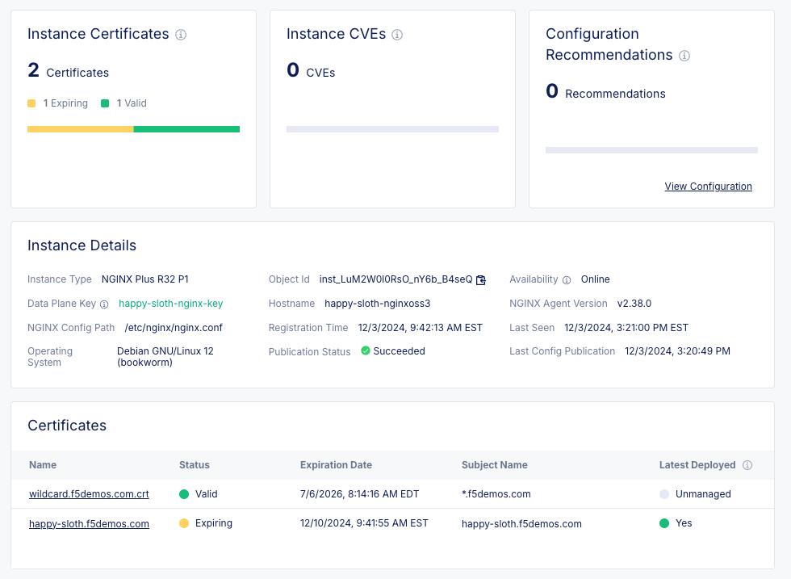

### Managed and Unmanaged Certificates

In [Part 2](./nginx-one-2.mdx) of this lab, you registered an instance to NGINX One Console, then added configuration that referenced an existing TLS certificate that was in the NGINX instance. Once you did so, this certificate became an _unmanaged certificate_. These certificates appear in the list of unmanaged certificates.

While you can inspect the details of an unmanaged certificate (including which instances they are used), you cannot update the certificate itself in the NGINX One Console. You will have to do so on the instances themselves by another means. However, **managed certificates** _can_ be updated by the NGINX One Console, and pushed to instances. Certificates can be imported into the console anew, or you can convert **unmanaged certificates** to **managed certificates**.

Though we will not do so in this lab, it is recommended that you convert your unmanaged certificates to managed certificates. Converting to a managed certificate allows you to centrally manage, update, and deploy a certificate to your NGINX instances from the NGINX One Console.

## Accessing NGINX One Console

1. If not already, log into into the F5 XC console, and navigate to the NGINX One console.

### Generating a Data Plane Key

1. From the NGINX One console, in the left hand menu under the "Manage" section, select **Data Plane Keys**.

1. Click **Add Data Plane Key**.

1. Give the key a name based on your lab's ephemeral name, such as **<GetVariable name="petname" />-nginx-key**

   > :point_right: **Note:** You are working in a shared environment; keep track of your resources, and be careful not to accidentally modify anyone else's.

1. By default, the key expiration date will be set to 1 year. Depending on your use case, you may want to set a shorter expiration date. For this lab, we will use the default value.

1. Click **Generate**.

   

1. The Data Plane Key will be displayed. Click the _Copy_ icon to copy the key to the clipboard.

   > :warning: **Warning:** _SAVE THIS KEY SOMEWHERE SAFE._ There is no way to retrieve the key after you click **close**. This key will be used in multiple labs.

   

1. Now enter the Data Plane Key in the _Set Variable_ component below and click the **Save** button; this will allow the lab guide to use the key in further steps.

:point_down: **\*Note:** This is not a screenshot - it is an interactive component of the lab guide\*.<br />

    <InputVariable
        name="NGINX_AGENT_SERVER_TOKEN"
    />

### Deploy NGINX Container

Now that we have a data plane key, we can attach a new NGINX OSS instance to the NGINX One Console.

1. To start your NGINX instance, click the **Run** button in this lab guide to deploy and have it automatically connect to the NGINX One Console:

   <DockerContainer>
     <Docker
       name="nginx-oss-3"
       desc="NGINX Plus R32 with Agent."
       image="private-registry.nginx.com/nginx-plus/agent:debian"
       env={[
         { name: "NGINX_AGENT_SERVER_GRPCPORT", value: "443" },
         { name: "NGINX_AGENT_SERVER_HOST", value: "agent.connect.nginx.com" },
         { name: "NGINX_AGENT_TLS_ENABLE", value: "true" },
         { name: "NGINX_AGENT_TLS_SKIP_VERIFY", value: "false" },
         { name: "NGINX_AGENT_SERVER_TOKEN", isVariable: true, isSecret: true },
       ]}
       attrs={[
         {
           name: "volume",
           value: `${process.env["CONTAINER_MOUNT_BASE_DIR"]}/ssl:/etc/nginx/ssl`,
         },
       ]}
     />
   </DockerContainer>

   <SetVariable name="nginx-oss-3" isComponent="true" />

   > Note: If you receive an error, it may be that you have not input and saved the **NGINX_AGENT_SERVER_TOKEN** variable above.

1. Once the NGINX instance is up and running, press the **Test** button, to confirm the instance is online and responding to HTTP requests.

### Configure NGINX Instance with TLS

In this section, we will configure our **<GetVariable name="nginx-oss-3" />** NGINX instance to leverage an SSL/TLS certificate that already exists on the instance.

1. In the NGINX One console, select _Manage_ and then _Instances_ from the left menu.

1. You should see your **<GetVariable name="nginx-oss-3" />** instance in the list. Click it to view the instance details.

1. Click the _Configuration_ link near the top of the instance screen, then click on _Edit Configuration_. You are presented with the configuration editor.

1. Edit the **/etc/nginx/conf.d/default.conf** file to add the following to the existing server block:

        ```nginx
            listen 443 ssl default_server;
            ssl_certificate /etc/nginx/ssl/wildcard.f5demos.com.crt.pem;
            ssl_certificate_key /etc/nginx/ssl/wildcard.f5demos.com.key.pem;
        ```

1. Click _Next_ to display the diff viewer. This view will show you the changes made to the configuration.

    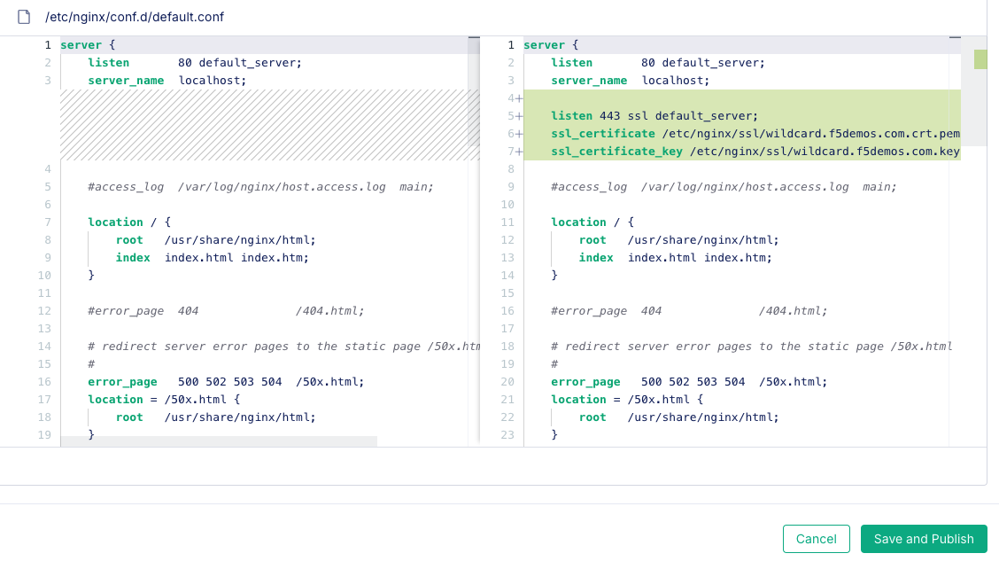

1. Click _Save and Publish_. You will see a status message indicating changes are being published, followed by a success message after several seconds.

1. Click the _Details_ link on the page, and select the _Unmanaged_ tab under _Certificates_. You should now see the certificate, its validity status, expiration date, and subject name. As indicated, this certificate is officially an **Unmanaged Certificate**. Any changes to the certificate need to be made on the instance itself.

1. To check that the **<GetVariable name="nginx-oss-3" />** instance is now listening on port 443, click the _Check_ button below.<br />

    <APICheck
      componentName="nginx-oss-3"
      targetStatusCode={200}
      tlsComponent={true}
    />

### Converting Certificate to Managed

As previously mentioned, NGINX One Console cannot update Unmanaged Certificates. For instance, if the certificate expired, it could not be updated through the console. You would have to update the certificate on the instance itself. Fortunately, you can convert **Unmanaged Certificates** such as the one used in the config above to **Managed**, opening the door to updating it through the console.

    > **Note:** We will not be performing certificate conversion in this lab. This is a shared environment, and everyone is using the same unmanaged certificate. However, we will be creating a unique Managed Certificate, which follows a similar workflow.

### Create Managed Certificate

You can create a Managed Certificate a couple different ways in the console:

- Add a new standalone certificate that is not used in a configuration
- Add a certificate during the configuration edit workflow

We will use the latter workflow, as it is a common desire to use a certificate in the NGINX configuration immediately after creating it.

This interactive lab guide has created a short-lived, unique certificate and key for you. Either save the certificate and key files below, or copy the certificate and keys individually. You can use either option when you create a Managed Certificate in later steps.<br /><br />

#### Your Unique Certificate and Key

<CreateCertificate commonName={`${process.env["PETNAME"]}.f5demos.com`} />

1. In the NGINX One console, select _Manage_ and then _Instances_ from the left menu.

1. You should see your **<GetVariable name="nginx-oss-3" />** instance in the list. Click it to view the instance details.

1. Click the _Configuration_ link near the top of the instance screen, then click on _Edit Configuration_. You are presented with the configuration editor.

1. Click _Add File_ in the upper right of the screen.

    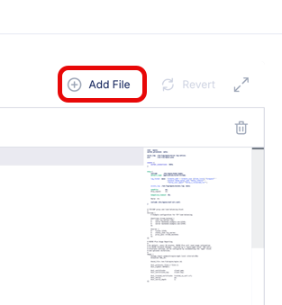

1. Click _New SSL Certificate or CA Bundle_.

    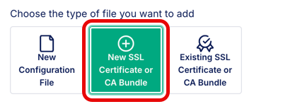

1. Leave _Manage through NGINX One_ enabled, and enter **<GetVariable name="petname" />.f5demos.com** as the _Name_.

    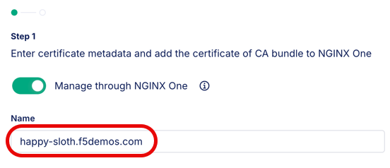

1. Select the _SSL Certificate and Key_ option.

    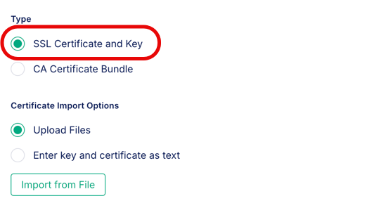

1. Choose either the _Upload Files_ **OR** _Enter key and certificate as text_ option.

    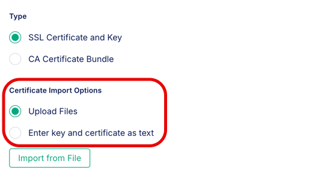

1. Depending on which option you chose above, follow the appropriate path in the following steps:

    #### If you selected the "Upload Files" Option

    1. Click the _Import from File_ button.

    1. Click the _Upload File_ button under the **_Certificate_** heading and select the **_<GetVariable name="petname" />.f5demos.com.crt.pem_** file that you download from the ["Your Unique Certificate and Key"](#your-unique-certificate-and-key) section above.

    1. Click the _Upload File_ button under the **_Key_** heading and select the **_<GetVariable name="petname" />.f5demos.com.key.pem_** file that you download from the ["Your Unique Certificate and Key"](#your-unique-certificate-and-key) section above.

    1. Click the _Import_ button.

            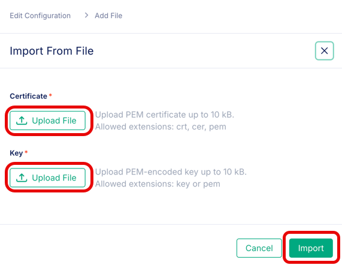

    1. If the import was successful, you will see the following:

            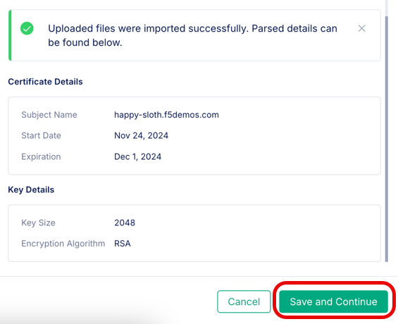

    1. Click the _Save and Continue_ button.

    1. Skip ahead to the [Add TLS Server Configuration](#add-tls-server-configuration) section.

    #### If you selected the "Enter key and certificate as text" Option

    1. Enter both the unique certificate and key copied from the ["Your Unique Certificate and Key"](#your-unique-certificate-and-key) section above.

            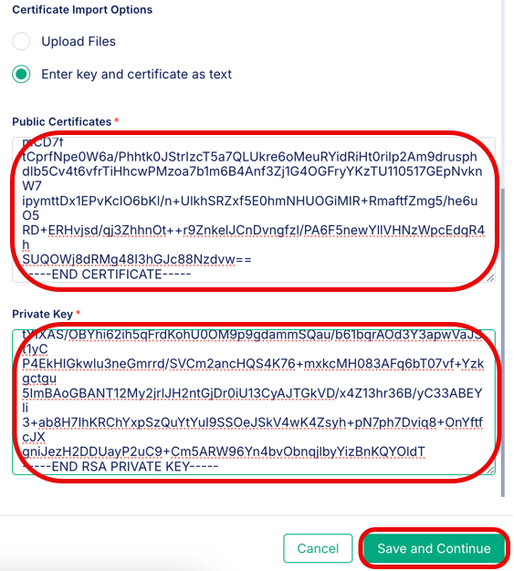

    1. Click the _Save and Continue_ button.

### Add TLS Server Configuration

1. Enter **_/etc/nginx/ssl/<GetVariable name="petname" />.f5demos.com.crt.pem_** in the **Certificate File Path** field.

1. Enter **_/etc/nginx/ssl/<GetVariable name="petname" />.f5demos.com.key.pem_** in the **Key File Path** field.

    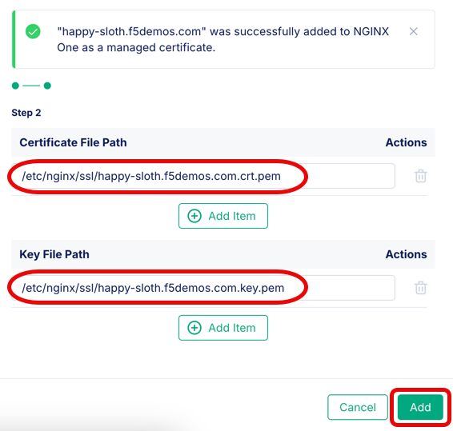

1. Click the _Add_ button.

    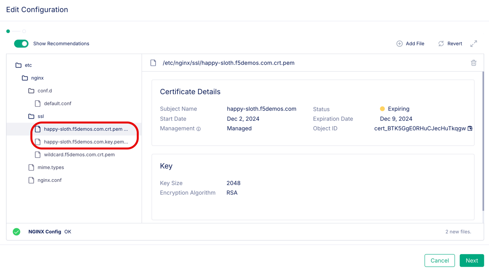

1. The certificate and key now appear in the file tree.

    > Note: These files have not been published yet.

1. Click the _Add File_ button in the top right.

1. Click _New Configuration File_.

1. Specify **_/etc/nginx/conf.d/<GetVariable name="petname" />.conf_** as the _File name_.

    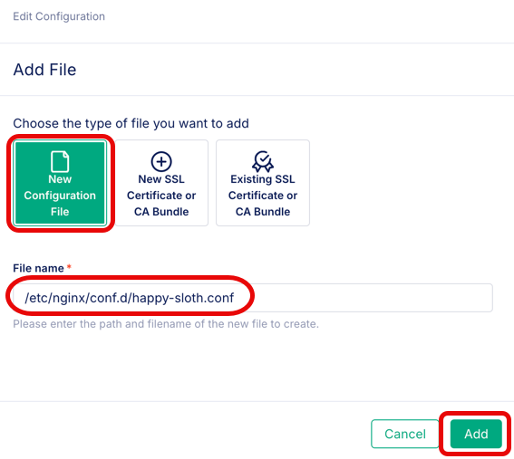

1. Click _Add_.

1. Paste in the following configuration:

    ```nginx
    server {
        listen 8443 ssl default_server;
        server_name {{petname}}.f5demos.com;
        ssl_certificate /etc/nginx/ssl/{{petname}}.f5demos.com.crt.pem;
        ssl_certificate_key /etc/nginx/ssl/{{petname}}.f5demos.com.key.pem;

        location / {
            root   /usr/share/nginx/html;
            index  index.html index.htm;
        }
    }
    ```

    This will create a new TLS listener at port 8443 using our new managed certificate.

1. Click _Next_.

1. This screen will show you the new config and certificate to be published to the instance. The green **"<span style={{color: 'green'}}>A</span>"** to the right of each file name indicates they are new files to be added when published.
  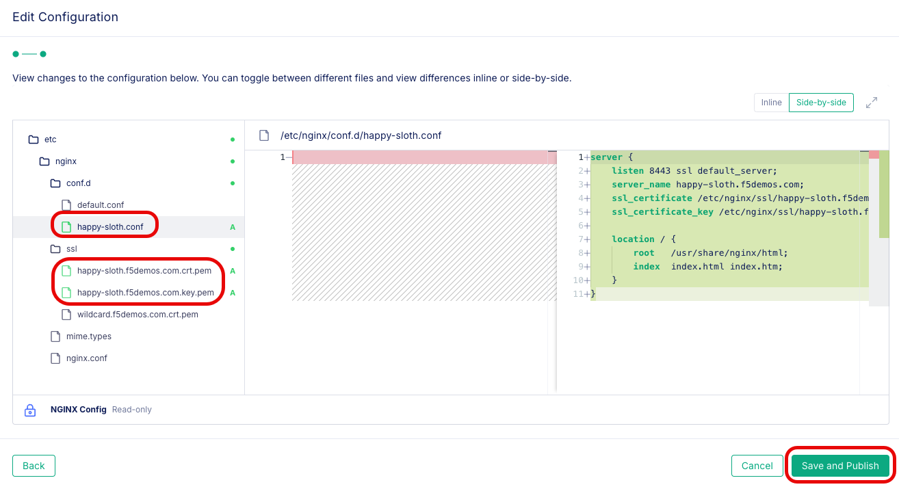

1. Click _Save and Publish_. After about 10 seconds, you will see a notification that the publishing was successful:

  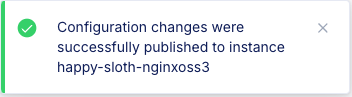

### Test the Configuration

  To check that the **<GetVariable name="nginx-oss-3" />** instance is now listening on 8443, click the _Check_ button below.

   <APICheck
     url={`https://${process.env["PETNAME"]}-nginxoss3:8443`}
     targetStatusCode={200}
   />

  Great! Now you have now demonstrated that you can successfully push a new certificate as well as a customized NGINX configuration to your NGINX instance.

### Review

Through the use of the Certificate Management features in NGINX One Console, you have now accomplished common tasks such as viewing the status of existing certificates, and uploading new ur updated certificates. The capability to perform this function within Config Sync Groups is also available to save operational toil associated with updating certificates across a cluster of NGINX instances. You can also perform these functions via the [NGINX One Console API](https://docs.nginx.com/nginx-one/api/api-reference-guide/) if you prefer to handle these steps through a pipeline.

## Cleanup

Time to clean up the remaining resources you created in this part of the lab. As a safety precaution, the NGINX One console will not allow you to delete an instance that is online. We will first have to shut down the instances before deleting them from the NGINX One console.

1. Click **Stop** on the Docker instance displayed below:

   <DockerContainer>
     <Docker
       name="nginx-oss-3"
       desc="NGINX Plus R32 with Agent."
       image="private-registry.nginx.com/nginx-plus/agent:debian"
       env={[
         { name: "NGINX_AGENT_SERVER_GRPCPORT", value: "443" },
         { name: "NGINX_AGENT_SERVER_HOST", value: "agent.connect.nginx.com" },
         { name: "NGINX_AGENT_TLS_ENABLE", value: "true" },
         { name: "NGINX_AGENT_TLS_SKIP_VERIFY", value: "false" },
         { name: "NGINX_AGENT_SERVER_TOKEN", isVariable: true, isSecret: true },
       ]}
       attrs={[
         {
           name: "volume",
           value: `${process.env["CONTAINER_MOUNT_BASE_DIR"]}/ssl:/etc/nginx/ssl`,
         },
       ]}
     />
   </DockerContainer>

   > **Note:** If the instance above initially shows a green **Run** button, you will need to refresh the lab guide page.

1. From the NGINX One console, in the left-hand menu in the _Manage_ section, select _Instances_.

1. Wait until your **<GetVariable name="petname" />-nginxoss3** instance transitions into the **Unavailable** state before proceeding. You may need to click the _Refresh_ button at the top right of the instance list.

1. On the **<GetVariable name="petname" />-nginxoss3** line of the instances table, select the _Actions_ "..." context menu, and select
   _Delete_.

   > :warning: **Warning:** Make sure you are deleting your own instances and not someone else’s.

   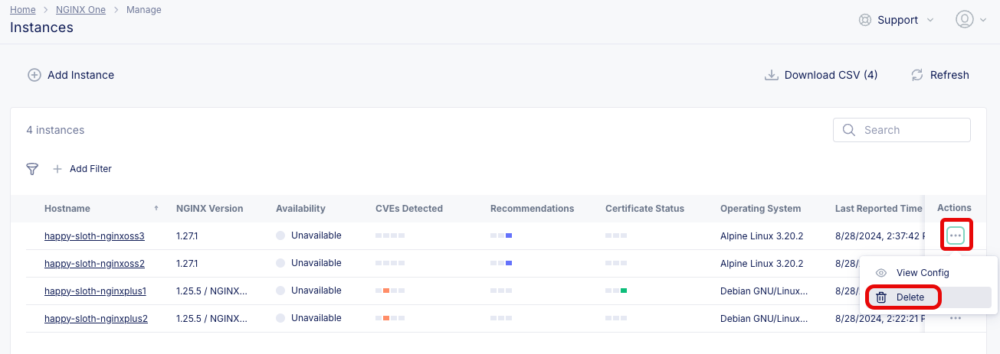

1. Confirm the deletion.

   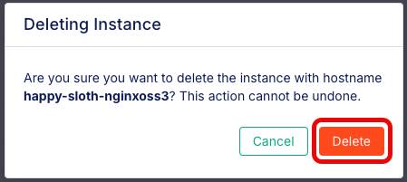

1. From the NGINX One console, in the left-hand menu in the _Manage_ section, select _Data Plane Keys_.

1. Select the context menu for the Data Plane Key you created in lab 1, and select _Revoke_.

   > :warning: **Warning:** Make sure you are revoking your own key and not someone else’s.

   

1. Confirm the revocation.

   

1. Select **Revoked Keys**. Then, select the context menu for the Data Plane Key you created in lab 1, and select _Delete_.

   

1. Confirm the deletion.

   

## Moving On

Part 5 of the lab is focused on using Declarative API to manage config in the console. [Proceed to Part 5 of the lab](./nginx-one-5.mdx).
