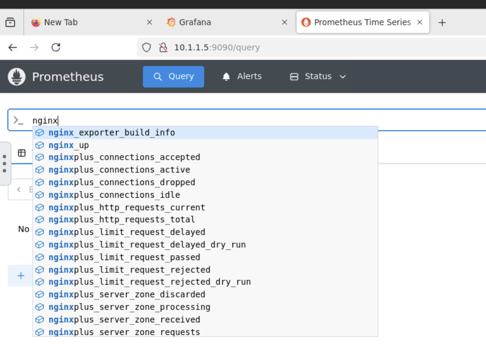

## What is Prometheus? 

Prometheus is an open-source systems monitoring and alerting toolkit. 
Prometheus collects and stores its metrics as time series data, i.e. metrics information is stored with the timestamp at which it was recorded, alongside optional key-value pairs called labels.
For more information, check out [Prometheus](https://prometheus.io/docs/introduction/overview/) official page.

## What is Grafana?

Grafana is a multi-platform open source analytics and interactive visualization web application. 
It can produce charts, graphs, and alerts for the web when connected to supported data sources.
To learn more, check out [Grafana](https://grafana.com/tutorials/) official page.

## Lab overview

You will see how to expose NGINX metrics to Prometheus and how Grafana can visualize that data.

## Step-by-step instructions
 
1. View exporter config
    - In order for NGINX to expose its metrics, nginx-prometheus-exporter needs to be installed in your NGINX instances. 
    For the scope of this lab, installation has been done for you. However, you can check out its config to understand the setup.
    - Open **Web Shell** of **NGINX Expansion** VM, type `cat /etc/systemd/system/nginx_exporter.service`, you should see this:
    ```
    [Unit]
    Description=NGINX Prometheus Exporter
    Requires=nginx_exporter.socket

    [Service]
    User=nginx_exporter
    ExecStart=/snap/bin/nginx-prometheus-exporter --nginx.plus --nginx.scrape-uri=http://127.0.0.1:8080/api --web.systemd-socket

    [Install]
    WantedBy=multi-user.target
    ```
    - If you are interested in the setup, check out the [guide](https://github.com/nginx/nginx-prometheus-exporter/blob/main/README.md) here

1. View Prometheus UI 
    > :warning: **Warning:** Do not use your computer's Firefox. Use the lab's Firefox.
    - Go to **Lab Expansion** VM, open **Firefox**, click on the **Prometheus** icon on the bookmark bar
    - You can try to type **nginxplus** on the search bar, a list of metrics with **nginx** prefix will appear
    

1. Add data source connection in Grafana
    - In Firefox, click on **Grafana** icon in the bookmark bar to open Grafana
    - Log in as user **admin** with password **admin123!**
    - On the left hand side, click on **Connection** > **Add new connect** > Type **Prometheus** in the search bar > Choose **Prometheus**
    - On the top right corner, click on **Add new data source**
    - Put a name for your data source, i.e **prometheus-nginx-expansion-vm**
    - Fill in **Prometheus server URL** with `http://10.1.1.5:9090`
    - Scroll down to the bottom and click **Save & test**
    - You should see the success message

1. Create dashboard in Grafana
    - On the left hand side, choose **Dashboards**
    - On the top right corner, choose **New** > **New dashboard**
    - Click on **Import Dashboard**
    - In the empty box, type `19314` (this is NGINX Plus dashboard ID), then click **Next**
    - If you like the dashboard default name, leave it
    - Under **Prometheus**, choose the data source you newly create above.
    - Choose **Import** and you should have a working dashboard now!
    - Congratulations! You have reached the end of the lab :boom:
    > :point_right: If your dashboard showing NGINX instance is down, go to the **Web Shell** of **NGINX Expansion** VM to check on the exporter status. 
    Type `systemctl status nginx_exporter`.
    If is it inactive, restart it by typing `systemctl start nginx_exporter`

## Summary

This part focuses on setting up Prometheus with Grafana for NGINX Plus monitoring. 
NGINX Plus has over 300+ metrics for deep visibility and analysis. 
You can explore to build more insightful and beautiful dashboards.

## END OF LAB
